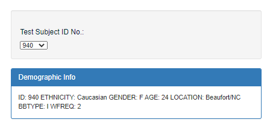
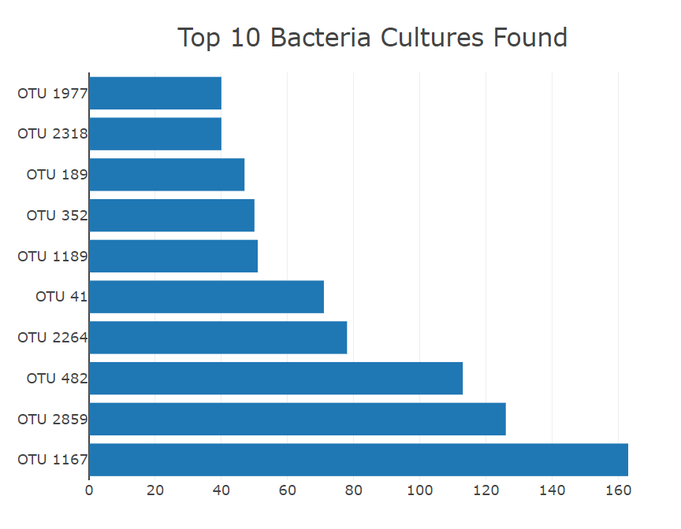
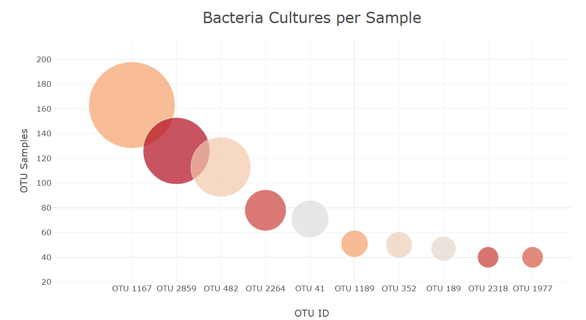
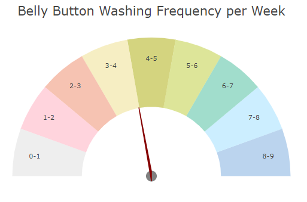
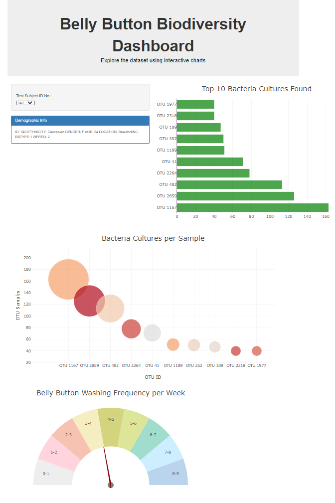

# Plot.ly Homework - BellyButton Challenge
 

## Scope
Build an interactive dashboard to explore the Belly Button Biodiversity dataset, which catalogs the microbes that colonize human navels.

## Interactive Dashboard Use
The dataset reveals that a small handful of microbial species were present in more than 70% of people.
You can check the Top 10 Bacteria Cultures and its samples distribution, while getting demographic information on each sample!

### Screenshots from findings

### Data source
Hulcr, J. et al.(2012) A Jungle in There: Bacteria in Belly Buttons are Highly Diverse, but Predictable
* http://robdunnlab.com/projects/belly-button-biodiversity/results-and-data/

## Bonus
Check the gauge meter that plots the weekly washing frequency of each individual

### The Interactive Dashboard 

### Checkout the GitHub Page!
* https://maribsoto.github.io/BellyButton_challenge/

